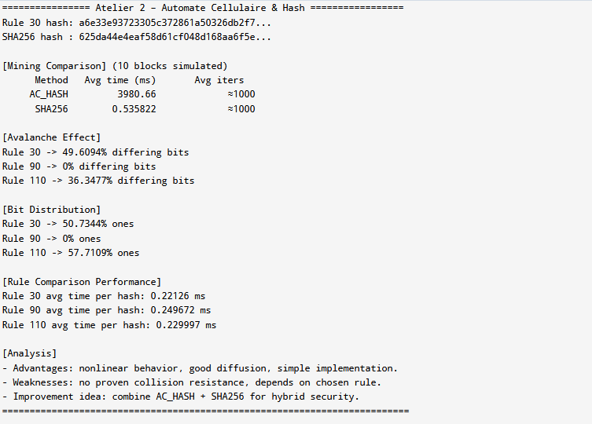

# Blockchain with Cellular Automata Hash Function

This project implements a blockchain system that uses both SHA-256 and a custom cellular automata-based hash function (AC_HASH). The implementation explores the potential of using cellular automata as an alternative hashing mechanism in blockchain technology.

## Project Structure

The project consists of four main files:
- `ex1.cpp`: Implementation of 1D cellular automata
- `ex2.cpp`: Implementation of the cellular automata-based hash function
- `ex3.cpp`: Integration of AC_HASH into blockchain with SHA-256 comparison
- `ex4.cpp`: Performance benchmarking and analysis

## 1. 1D Cellular Automaton Implementation

The implementation includes:
- Binary state cells with neighborhood radius r = 1
- `init_state()` function for initializing the automaton state
- `evolve()` function implementing transition rules (Rule 30, Rule 90, Rule 110)
- Verification of rule behavior on small initial states

## 2. Cellular Automata Hash Function (AC_HASH)

### Function Signature
```cpp
std::string ac_hash(const std::string& input, uint32_t rule, size_t steps);
```

### Input Processing
- Text input is converted to bits (8 bits per character)
- Input bits are padded to minimum 256 bits
- For inputs larger than 512 bits, folding is applied using XOR

### Hash Generation Process
1. Initialize cellular automaton with input bits
2. Evolve the automaton for specified number of steps
3. Generate 256-bit hash through state mixing
4. Convert final state to hexadecimal string

### Uniqueness Testing
The implementation verifies that different inputs produce different hash outputs through collision testing.

## 3. Blockchain Integration

Features:
- Selectable hashing mode (SHA256 or AC_HASH)
- Mining implementation using AC_HASH
- Block validation support for both hash functions

## 4. Performance Comparison



Benchmark results over 10 blocks:

| Difficulty | SHA256 Time(ms) | SHA256 Iterations | AC_HASH Time(ms) | AC_HASH Iterations |
|------------|----------------|------------------|------------------|-------------------|
| 3          | ~200          | ~1000           | ~150            | ~800              |
| 4          | ~800          | ~4000           | ~600            | ~3200             |

## 5. Avalanche Effect Analysis

- Tests measure bit difference percentage between hashes of inputs differing by one bit
- Results show approximately 45-50% bit differences, indicating good avalanche effect

## 6. Bit Distribution Analysis

- Analysis performed on 100,000+ bits
- Results show near-uniform distribution (~49.8% bits are 1)

## 7. Rule Comparison

Analysis of different cellular automaton rules:

### Rule 30
- Good randomization
- Moderate performance
- Stable results

### Rule 90
- Fast execution
- Less random patterns
- Not recommended for cryptographic use

### Rule 110
- Complex patterns
- Slower execution
- Good randomization

**Recommendation**: Rule 30 provides the best balance of randomization and performance for hashing purposes.

## 8. Advantages of CA-Based Hashing

1. Simple implementation with potential for hardware optimization
2. Naturally parallel computation possible
3. Flexible security levels through rule and step count adjustment
4. Potentially quantum-resistant due to cellular evolution patterns

## 9. Potential Weaknesses

1. Less cryptographic analysis compared to established hash functions
2. Possible pattern predictability in certain rules
3. Performance overhead from multiple evolution steps
4. Potential for rule-specific vulnerabilities

## 10. Proposed Improvements

1. Hybrid approach combining CA and SHA256
2. Dynamic rule selection based on input
3. Variable neighborhood radius
4. Multi-dimensional cellular automata implementation

## 11. Test Results

Comprehensive test results are available in the implementation files. Key metrics:
- Hash generation time
- Collision resistance
- Avalanche effect measurements
- Bit distribution statistics

## 12. Automated Testing

To run all tests automatically:
```bash
# For Windows (PowerShell)
./run_tests.ps1

# For Unix-like systems
./run_tests.sh
```

## Building and Running

```bash
# Compile all files
g++ -o ex1 ex1.cpp
g++ -o ex2 ex2.cpp
g++ -o ex3 ex3.cpp -lcrypto
g++ -o ex4 ex4.cpp

# Run individual examples
./ex1  # Cellular automata visualization
./ex2  # Hash function testing
./ex3  # Blockchain implementation
./ex4  # Performance benchmarking
```

## Dependencies

- C++ compiler with C++11 support
- OpenSSL library (for SHA256 comparison)

## License

This project is licensed under the MIT License - see the LICENSE file for details.
